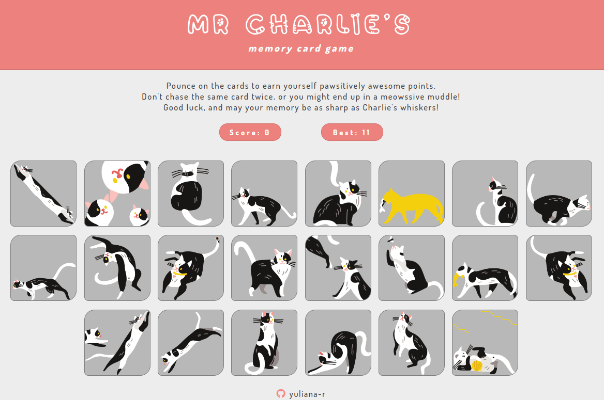

# Memory Card Game
## Introduction 

This project is a browser memory game built with React and themed around my black & white cat  Charlie.
The goal of the game is to never click the same card twice. 

The project primarily demonstrates use of useState and useEffect hooks to create a React app using only functional components.

## Preview

## Media & assets credits:

1. Flaticon (AomAm): https://www.flaticon.com/free-icons/cat

2. Freepik (macrovector): https://www.freepik.com/free-vector/cats-character-set-with-isolated-images-similar-black-white-kitten-pet-different-poses-vector-illustration_26763548.htm 
> Craftfully edited by [Mao](https://github.com/MaoShizhong).

3. Wallpaper Access: https://wallpaperaccess.com/simple-aesthetic-pattern#203019 

4. FontSpace (Helotype): https://www.fontspace.com/katto-outline-font-f62028